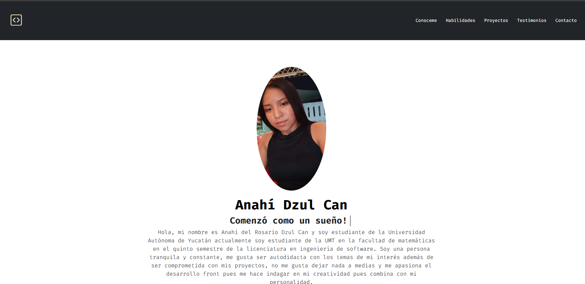
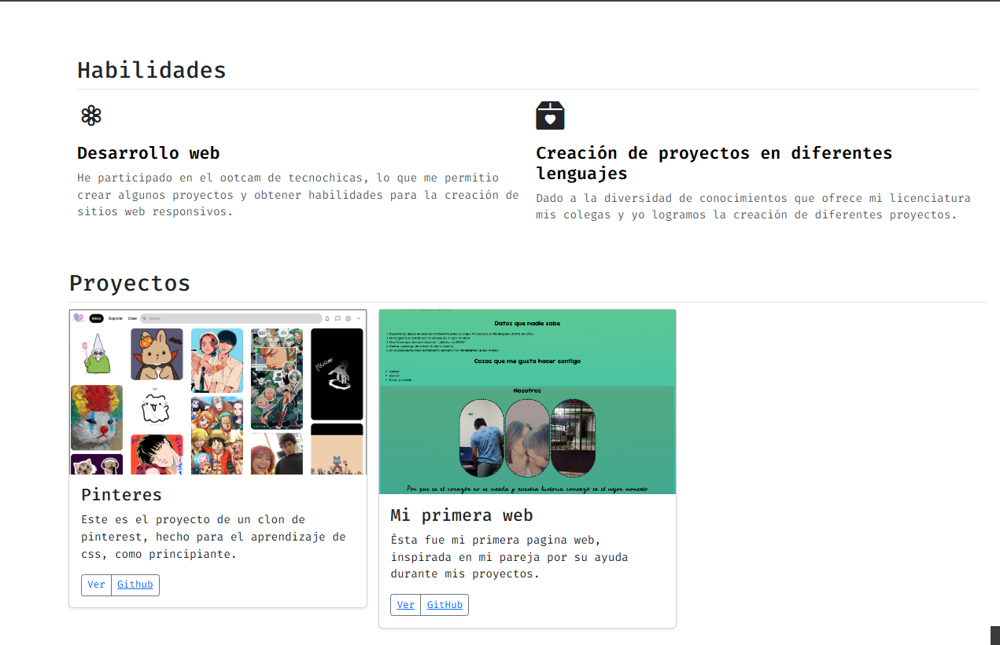

## Portafolio de proyectos 

¡Hola! Soy **Anahi del rosario Dzul Can**, atualmente estudio en la UMT (Unidad Multidisiplinaria Tizimin) en la licenciatura de ingeniería de software y estoy cursando el 5 semestre.

Soy nueva en el mundo de creación Frontend pero es una disiplina que me gustaría aprender para ejercer del mismo en un futuro.
___________________________________

#### Este proyecto cuenta con diversas secciones para poder conocer más acerca de mí desempeño durante mi preparación:

✔ Habilidades
✔ Proyectos 
✔ Testimonios
✔ Contacto

##### Creado con: 
💻 Html
💻 Css
💻 JavaScript

##### Vista previa

Espero pronto nos pongamos en contacto para un nuevo **sueño**

- **Correo**
    📨 [anahidcan@gmail.com](mailto:anahidcan@gmail.com)

#### Creado en el bootcam de TecnolochicasPro 🎇